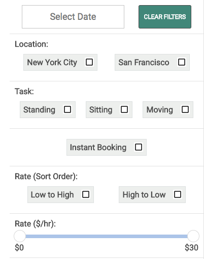
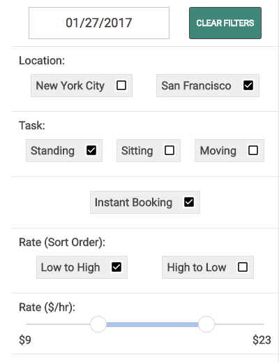
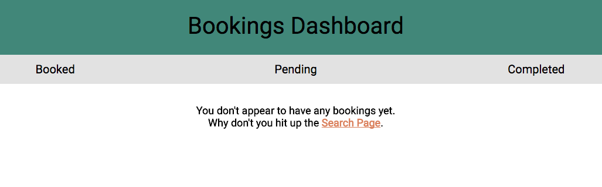
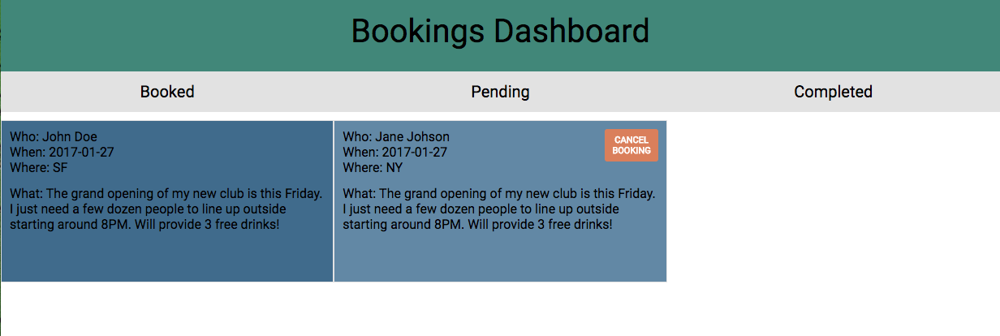

[Live Link!](https://www.sheeple.co)

Sheeple is a web application that allows new businesses to create buzz by hiring people to create a crowd.

## Features

### Logging In
- Log in as a new user or test out the site using a guest profile.
- Data is saved for future visits.
- Password secured using backend encryption.

### Search
Sheeple lets you quickly sort through "sheep" with a simple search filter. A handy "Clear Filters" button quickly and easily resets the filters:  

- Search listings include relevant information about the Sheeple to help you make your decision.
- Icons help to distinguish between sitters, movers, and standers.
- "Instant Booking" allows for booking without the need for confirmation first.
- Booking buttons change dynamically depending each Sheeple's preferences.

### Search

All tasks are stored on the Dashboard page. They are conveniently divided into three columns: Completed, Booked, and Pending. Bookings can be canceled if they have not yet been confirmed.

## Implementation
Implemented Airbnb's [slider][slider] and [date picker][dates] for search filtering.

[slider]: https://github.com/airbnb/rheostat
[dates]: https://github.com/airbnb/react-dates
